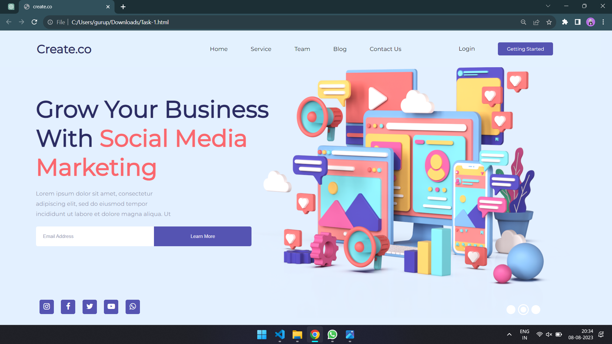

# Task 1: Landing Page - README

## Description
This is a landing page created as part of Task 1 for the "Journey Through the Past" project. The goal was to replicate the design shown in "task1.png" using HTML and CSS, while ensuring responsiveness for various screen sizes.

## Page Preview
Here's a preview of the landing page:

## Task Details and Resources
For more detailed information about the task requirements and the resources used, please visit the official task repository:
[Task 1 Repository](https://github.com/Technity-Amaravati/technity-tech/tree/main/TASK%201)

## Features and Approach
- **Navbar:** A navigation bar is implemented at the top of the page, containing links to different sections of the website.
- **Half-Text Half-Image Section:** This section presents the main message of the landing page using text and an engaging background image.
- **Form:** A subscription form is included, allowing users to input their email addresses and learn more about the service.
- **Social Media Icons:** Icons linking to various social media platforms are placed in the footer of the page.
- **Responsive Design:** The page layout adapts to different screen sizes, enhancing the user experience across devices.

## Tech Stack
- HTML
- CSS
- Font Awesome Icons
- Google Fonts (Montserrat, Oswald)

## How to View
1. Clone this repository to your local machine.
2. Open the `index.html` file in a web browser.

## Reflection
Building this landing page was an opportunity to practice my HTML and CSS skills while focusing on design and responsiveness. I followed the provided design specifications and utilized the resources from the "Resources" folder.

## Credits
- Design inspiration and resources provided by the "Journey Through the Past" project.
- Fonts: Montserrat and Oswald from Google Fonts.
- Icons: Font Awesome.

---
*Please note: This project was completed as part of an educational task and is not intended for commercial use.*
